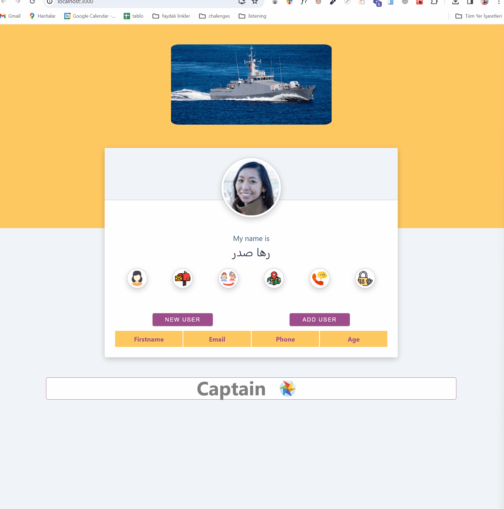

# Random User App
## Outcome



## Description

Project aims to create a Random User App.

## Project Skeleton

```
03 - Random User App
|
|----readme.md         # Given to the students (Definition of the project)
SOLUTION
├── public
│     └── index.html
├── src
│    ├── assets.js
│    │       └── [images]
│    ├── App.js
│    ├── App.css
│    ├── index.js
│    └── index.css
├── package.json
└── yarn.lock
```


## Objective

Build a Random User App using ReactJS.

### At the end of the project, following topics are to be covered;

- HTML

- CSS

- JS

- ReactJS
